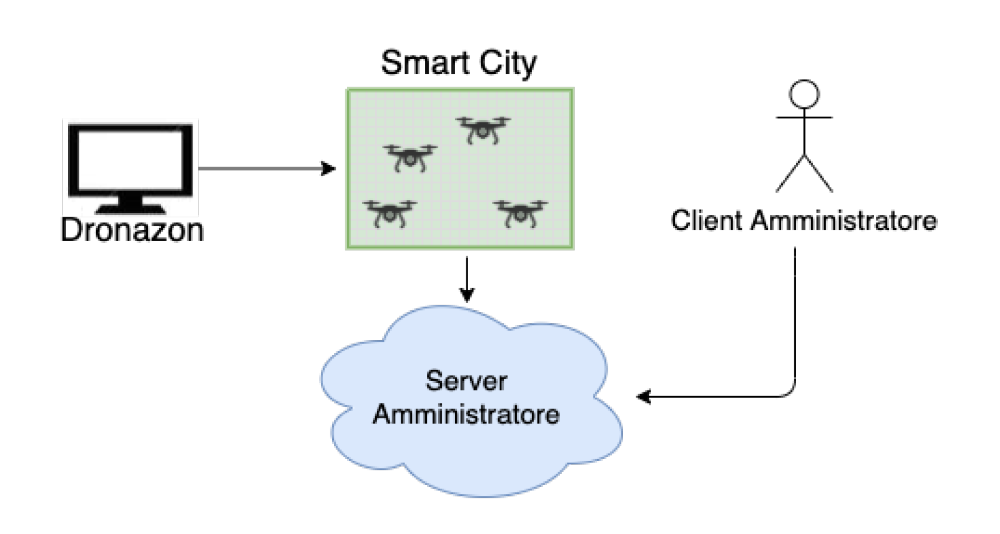

# Dronazon

- **Autori:** Alessia Libertucci
- **Corso:** Distributed and Pervasive Systems (A.A. 2020/2021) 

## Description
The project implements a system that manages the deliveries of orders received from the Dronazon e-commerce site, through the use of drones. Figure below shows the architecture of the developed system.

